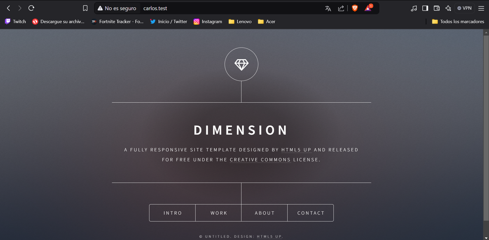
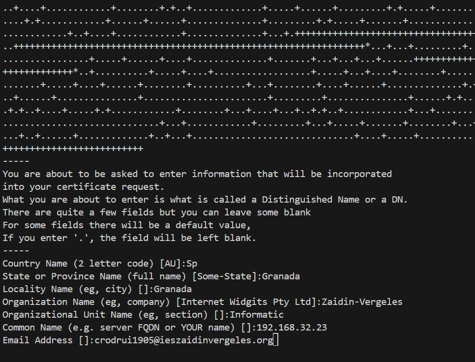
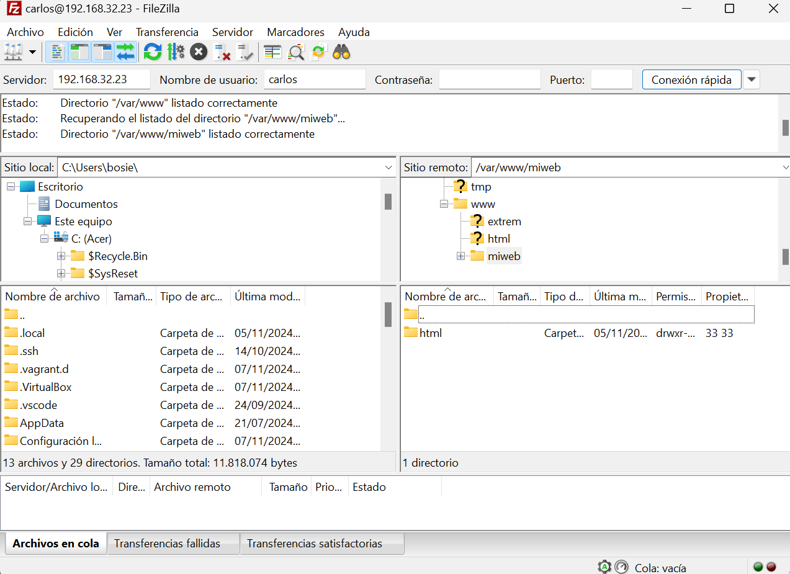
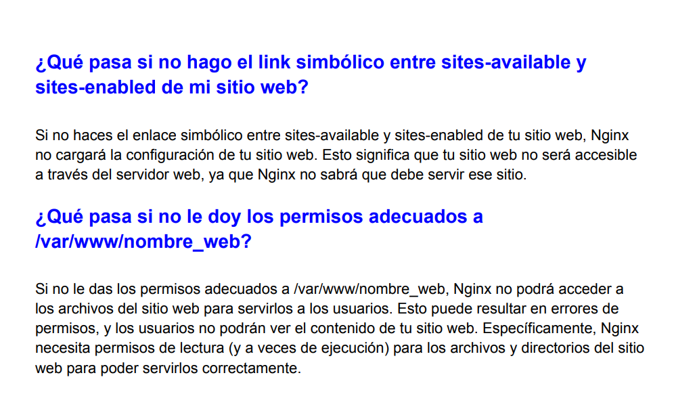

# Práctica de Configuración de Servidor Web y FTP

Este proyecto configura un servidor web y un servidor FTP utilizando Nginx y vsftpd en una máquina virtual provisionada con Vagrant.

## Pasos Realizados

1. **Actualización de Repositorios e Instalación de Software**
   - Se actualizaron los repositorios y se instalaron Nginx, Git y vsftpd.
   - Se verificó que Nginx esté funcionando correctamente.

2. **Configuración del Sitio Web "miweb"**
   - Se creó la carpeta del sitio web en `/var/www/miweb/html`.
   - Se clonó un repositorio de ejemplo en la carpeta del sitio web.
   - Se asignaron los permisos adecuados a la carpeta del sitio web.
   - Se configuró Nginx para servir el sitio web.

   

3. **Configuración de Nginx para "extremweb"**
   - Se creó la carpeta del sitio web en `/var/www/extrem/html`.
   - Se asignaron los permisos adecuados a la carpeta del sitio web.
   - Se configuró Nginx para servir el sitio web.

   

4. **Configuración de FTP**
   - Se creó el usuario `carlos` y se le asignó una contraseña.
   - Se creó la carpeta `/home/carlos/ftp` y se le asignaron los permisos adecuados.
   - Se copió el archivo de configuración de vsftpd a `/etc/vsftpd.conf`.
   - Se generaron los certificados de seguridad para vsftpd.
   - Se agregó el usuario `carlos` al grupo `www-data`.

   
   

## Archivos Importantes

- `provision.sh`: Script de provisión que realiza todas las configuraciones mencionadas.
- `vsftpd.conf`: Archivo de configuración de vsftpd.
- `Vagrantfile`: Archivo de configuración de Vagrant.

## Conclusión

En esta práctica, hemos configurado un servidor web y un servidor FTP en una máquina virtual utilizando Vagrant. Se han realizado todas las configuraciones necesarias para asegurar el correcto funcionamiento de ambos servicios.

## Respuestas a las preguntas

